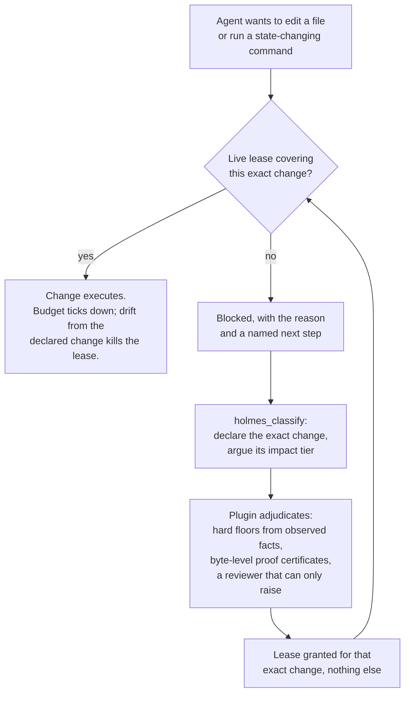
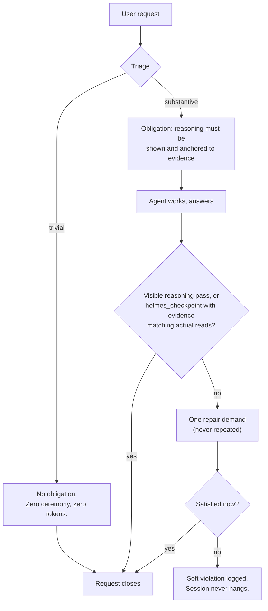

# omp-holmes

HOLMES is a reasoning framework for LLM agents, shipped as a plugin for [OMP](https://omp.sh), a coding-agent harness. It makes an agent work out what you actually asked for, reason backward from that end state, and prove the work, before it is allowed to act on anything that matters.

Watch an unassisted agent take a non-trivial task and the pattern is always the same: anchor on the first plausible interpretation, start reading and searching, a dozen calls, two dozen, assemble a story from whatever came back, edit, report success in confident prose. The result is built on satisficing assumptions, whatever was good enough to keep moving. When it is wrong, it is wrong with conviction.

HOLMES inverts the order. Before the agent may explore, it has to establish what the finished result looks like as the user intended it, separate what it knows from what it is assuming, and name the unknowns a lookup is supposed to close. The engine underneath is abductive reasoning: start from the desired result, infer what would have to be true for that result to hold, then verify those conditions instead of wandering toward them. Search stops being a fishing trip and becomes a step that fills a named variable.

The change is visible in ordinary use. Instead of a wall of one-off reads, the agent thinks, then acts in a few deliberate strokes; a request that would have burned thirty exploratory calls tends to come back as one composed program in the agent's sandbox, delivered in what looks like a single shot, because the thinking happened before the acting.

None of this happens because a prompt asked nicely. Prompts decay, and a model under pressure satisfices; that is what it is. So the discipline is enforced rather than requested. A deterministic cognitive redirect interrupts the forward chain at the start of every piece of work: stop, define done, sort known from assumed from unknown, only then classify the gap. A deterministic classifier reads the request itself and decides how much proof closing it will require. Runtime gates hold the line, and at those gates the agent's own claims count for nothing; only evidence the plugin observed with its own code unlocks anything.

Trivial work stays free. "What branch am I on?" triggers no ceremony at all, because an enforcement system that taxes everything teaches its operator to uninstall it.

One honest note on what is actually happening underneath. The output reads like objective, extrapolative thinking: end state first, unknowns named, evidence closing them. No new faculty was added to the model. A language model interpolates; HOLMES is attention steering, arranging what the model attends to so that interpolation lands where genuine backward reasoning would have. The bet is that the gap between a sloppy agent and a rigorous one was never raw capability. It is what the next token is conditioned on.

## The two gates

### Permission to change things

Before the agent may edit a file or run a state-changing command, it must declare the exact change and prove its blast radius. What it gets back is a lease for that exact change and nothing else; drift from the declaration and the lease evaporates. The "while I'm here" extra fix dies at this gate.



### Permission to be done

A substantive answer does not close because the agent stopped talking. The reasoning has to be shown, and evidence cited in it is checked against what the agent actually read during the request. "I verified this" counts for nothing; a passing tool result counts. One repair demand, never a loop.



Everything below is the operator manual: the exact tiers, gates, tools, and counters, under the names used in the code. [FRAMEWORK.md](FRAMEWORK.md) is the conceptual deep dive: how agent reasoning fails, why guidance alone cannot fix it, and the design rules behind the enforcement.

## The cognitive model

### Layer 0: the redirect

Layer 0 runs every turn. It is the always-on habit the rest of the system enforces:

| Step | Meaning |
|------|---------|
| **HALT** | Stop before planning or effectful tools. |
| **ENVISION** | Define concrete, verifiable "done". |
| **LOCATE** | Separate KNOWN facts from ASSUMED beliefs and UNKNOWN gaps. |
| **DELTA** | List required changes and evidence gaps. |
| **CLASSIFY** | Before mutation-capable tools, call the extension-owned `holmes_classify` tool; its returned tier, requirements, and scope are authoritative. Answer closure is enforced separately by the answer gate. |

### The HOLMES loop

For non-trivial mutation work (Tier 3 and above), classification requires the full inner loop:

| Phase | Meaning |
|-------|---------|
| **H**one | Pin the TARGET: what must be true when the work is complete. Outcomes, constraints, non-goals, acceptance criteria. |
| **O**bserve | Ground the NOW: sourced facts with provenance (file, symbol, line range), not inferences from naming. |
| **L**adder | Reason backward from target to now: the necessary conditions, in dependency order, each rung closing one uncertainty. |
| **M**ap | Surface the VARIABLES: unknowns, blockers, decision points, and the execution route with verification built in. |
| **E**stablish | Close the gaps with evidence, or re-enter the loop when new blockers, conflicting evidence, or surprising state appear. |
| **S**ynthesize | Produce the concrete mutation scope and verification criteria that classification will bind to. |

Tier 4 work iterates the loop until the latest synthesis is a fixed point: no blocking unknowns, scope matching the cumulative request, evidence present, and a concrete mutation lease able to cover the next effect.

## Trust architecture: the model proposes, the extension disposes

Nothing the model says grants authority. Visible `[CLASSIFY: Tier N]` markers, hidden thinking, code comments, answer prose, and tool-call arguments are untrusted claims. Mutation authority is the extension-owned `holmes_classify` tool: it executes inside trusted extension code, its record is what the runtime mutation gate checks, and its returned tier, requirements, lease, and scope are binding. Answer authority is the answer gate state, also extension-owned; only an extension-observed visible pass or an executed `holmes_checkpoint` record can satisfy it. Mutations outside the returned scope require a new classification. Answers whose observed facts outgrow their satisfied obligation reopen at the higher level.

## Answer gate

Every user request gets an `AnswerObligationLevel`: `none`, `light`, or `full`.

Initial triage is deterministic:

| Level | Semantics | Triage |
|-------|-----------|--------|
| `none` | Trivial answer. No visible ceremony. | Request is below `ANSWER_TRIVIAL_REQUEST_CHARS`, has no code fence, has at most one question, and has no reasoning-verb or multipart markers. |
| `light` | Substantive but bounded answer. | Default for non-trivial requests that do not need design-grade reasoning. |
| `full` | Design-grade answer. | Reasoning-heavy request shapes: multiple reasoning verbs, or a reasoning verb combined with code-fence / multipart structure. |

Escalation is monotone and uses only extension-observed facts:

- `none` escalates to `light` when the final visible answer reaches `ANSWER_SUBSTANTIVE_CHARS`, contains a code block, or the request used at least `ANSWER_TOOLCALL_LIGHT` tool calls.
- Any level escalates to `full` when the request reaches `ANSWER_TOOLCALL_FULL` tool calls, emits a heavy multi-code-block answer at `ANSWER_HEAVY_CHARS`, or has a live valid Tier 3/4 `holmes_classify` record for the same request digest. That last rule is the gate weld: mutation-side Tier 3/4 analysis forces answer-side `full` closure.
- A request satisfied at a lower level reopens if later observed facts escalate past `satisfiedAtLevel`. Levels only move `none` → `light` → `full`.

Satisfaction paths:

- `none`: frictionless. `agent_end` marks it satisfied; no checkpoint demand is issued.
- `light`: visible `TARGET` / `DELTA` / `NEXT` sections, or a successful `holmes_checkpoint`.
- `full`: visible Hone / Observe / Ladder / Map / Establish / Synthesize sections with at least one evidence reference verified against the request tool log, or a successful `holmes_checkpoint`.

At `agent_end`, an unmet `light` or `full` obligation schedules exactly one `nextTurn` checkpoint demand while `retriesUsed < MAX_ANSWER_RETRIES`. The demand asks for the missing visible pass or a `holmes_checkpoint` call. If the demand cannot be sent, or the next terminal pass still does not satisfy the obligation, the gate soft-accepts: it records `answerSoftAccepts` and `reasoningSoftViolations` and stops. Worst case is one extra turn. The answer gate never hangs the session and never blocks tool execution.

## The four-tier prove-down impact model

HOLMES classifies the impact of the finished work, not the size of the request:

| Tier | Impact |
|------|--------|
| **Tier 4** | Potentially cascading or unresolved impact: cross-system propagation, safety/security surfaces, public contracts, data, deployment, multi-agent coordination, or unresolved unknowns. |
| **Tier 3** | Bounded, but still needs HOLMES analysis: one full loop pass to close the unknowns. |
| **Tier 2** | Predictable local behavior change. TARGET/DELTA before mutation is enough. |
| **Tier 1** | Cosmetic, provably no behavior change. Never valid for new creative or research deliverables. |

Classification starts at the highest plausible tier and steps down only on positive evidence: 4→3 prove the impact is bounded, 3→2 prove it is predictable, 2→1 prove it is null. "This is simple", "mechanical", and "low impact" are claims, not proof. The absence of scary words is not proof either.

## The three-layer adjudication pipeline

Each `holmes_classify` call runs through three layers with strictly separated authority.

### Layer 1: objective impact floors

Hard minimum tiers derived only from extension-observed facts: file path roles (source vs test vs config vs docs vs agent-guardrail vs sensitive surfaces), tool classes (structured vs opaque), and the cumulative ledger state. Floors cannot be overridden by anything the model claims. A floor at Tier 3 means the result is never lower than Tier 3, whatever the arguments.

### Layer 2: evidence certificates

The only authority that can lower a tier. Certificates are computed by the extension itself from the exact planned payloads (the `exactPatch` / `exactContent` the model pre-committed) diffed against the extension's own snapshot of the target files. Examples: blank-line-only, comment-only, docs-prose-only, whitespace-only, AST-equivalent, exports-unchanged, references-bounded, session-scoped-only. The extension computes them from real bytes, so they are proof rather than narrative.

### Layer 3: the mutation risk prosecutor

An LLM reviewer on the mutation path whose authority is strictly upward-only: it can raise concern (add floors, surface proof obligations) but never grant safety or lower a tier. It is fed a quarantined packet in which all model-originated text is labeled as untrusted claims, so a persuasive self-assessment cannot launder itself into authority. If the prosecutor times out or errors, the deterministic result stands.

The shape of the pipeline is the point: facts set the floor, mechanical proof is the only way down, and judgment can only push up.

## Reasoning grader

The reasoning grader is separate from the mutation risk prosecutor. It grades closure quality after the deterministic gates have already found a candidate answer pass or Tier 3/4 mutation pass.

It grades exactly three axes:

| Axis | Meaning |
|------|---------|
| `chain` | Backward-chain coherence: steps must trace TARGET → NOW and not become orphan forward-chained steps. |
| `closure` | Unknown closure: every unknown claimed closed must cite an id from `facts.verifiedEvidenceIds`. The grader checks linkage only; it does not decide whether evidence is true. |
| `plan` | Plan traceability: every plan step must map to a chain step or an explicitly open unknown. |

Authority is deliberately narrow. The grader produces suspicion and repair-demand input, nothing else. It cannot lower tiers, mint certificates, mark `mutation_ready`, satisfy answer obligations, authorize mutation, or clear deterministic floors. For answer `full`, high/medium defects with valid citations to verified evidence, or a hollow/incoherent result with tool calls but no verified evidence, can withhold satisfaction once via `MAX_GRADER_HOLLOW_FLAGS`. Past that cap, further hollow/incoherent results are advisory, and the gate soft-accepts if it was already awaiting repair. `failed` / `skipped` grader status, malformed output, parse rejection, call errors, and timeouts are all inert.

Bounds are explicit. `MAX_GRADER_CALLS_PER_REQUEST` caps uncached calls per request; successful assessments are cached by `graderCacheKey`; answer caches are per request digest (`createReasoningGraderRequestCache`) and pruned on new request digests. Grader calls use `DEFAULT_GRADER_TIMEOUT_MS` unless `HOLMES_GRADER_TIMEOUT_MS_FLAG` (`holmes-grader-timeout-ms`) supplies a valid timeout, and the model output budget is `REASONING_GRADER_MAX_TOKENS`.

Mutation-pass grading is off by default. `src/main.ts` registers `HOLMES_GRADE_MUTATION_PASSES_FLAG` as the OMP boolean flag `holmes-grade-mutation-passes`; set it to `true` to grade after deterministic Tier 3/4 mutation pass readiness. That variant writes grader verdict/axes into the classification record and can add `graderObligations`, but it still cannot lower a tier, create a lease, or satisfy a certificate.

## Mutation leases

Passing classification does not yield a binary "approved" flag. It yields a lease: authority scoped to specific tools, paths, an effect fingerprint, and a mutation budget. Each allowed mutation consumes budget. Exhausted, drifted, or expired leases evaporate.

Exact-payload pre-commitment is mechanized ENVISION. To classify an `edit`, the model supplies the exact patch it will submit (`structuredEffect.exactPatch`); for `write`, the exact content (`exactContent`); for `ast_edit`, the exact ops; for opaque tools (`bash`, `eval`, `task`), the exact command or code (`exactOpaqueInput`). The model must know precisely what it intends before authority exists. When the actual tool call deviates from the pre-committed payload, say an improvised "small extra fix", the effect fingerprint no longer matches and the authority evaporates. Sloppy envisioning becomes a concrete, felt cost.

## The cumulative request ledger

Every user request gets a ledger that accumulates classifications, blocked effects, scoped floors, and verification outcomes across the whole request. The ledger kills two evasion patterns:

- Tool-shopping: getting blocked on `edit` and retrying the same effect through `bash`. The ledger remembers the blocked effect.
- Classification re-rolls: re-calling `holmes_classify` with rosier prose until the tier drops. Prior floors persist in the ledger and apply to overlapping scope.

Verification failures floor the scope at Tier 4. When a verification-capable tool fails against paths in scope, the ledger records an unresolved failure, and every later classification overlapping those paths is floored at Tier 4. The only exit is an extension-observed successful verification covering the failed paths: a real passing tool result, not a claim that things are fine now. Fail-closed, but always with a provable exit.

## Enforcement surfaces

| Surface | Behavior |
|---------|----------|
| System prompt | The HOLMES classification checkpoint and answer protocol are appended on every agent start (`APPEND_SYSTEM.md` is the source copy). |
| TTSR rules (8) | Stream-time rules that abort generation mid-stream when the text shows a failure pattern forming. |
| Skill | `skills/holmes/SKILL.md`: the full HOLMES playbook for on-demand reference. |
| Commands (3) | `/holmes`, `/holmes-goal`, `/holmes-status`. |
| Tool-call gates | Runtime `tool_call` interception, in order: primitive-burst → delegation → classification. `holmes_classify` and `holmes_checkpoint` are guard-exempt. |
| Answer gate | `message_end` / `agent_end` reconciliation: triage, monotone escalation, visible-pass or checkpoint satisfaction, and one-shot `nextTurn` repair demand. |
| Tool-result modifiers | Verification reminders appended after mutating edit/write/apply-style results; verification outcomes feed the ledger. |

### Stream-time rules (TTSR)

`rules/RULES.md` is the always-apply compact Layer 0 redirect. Seven conditional rules abort generation mid-stream when their pattern fires:

- `forward-chain-guard.md`: direct mutation plans before END/DELTA evidence (forward-chaining intent)
- `assumption-guard.md`: assumptions being converted into action
- `batch-primitive-prose.md` / `batch-primitive-numbered.md`: prose or numbered plans chaining primitive discovery calls
- `edit-without-verify.md`: edit plans that omit a verification step
- `eval-mutation-intent.md`: attempts to use `eval` as a mutation-gate bypass
- `eval-mutation-code.md`: filesystem-mutation code inside eval cells

Recommended TTSR settings: `repeatMode: "afterGap"` with `repeatGap: 3`, so rules re-arm after short gaps instead of firing once per session.

### Runtime gates

On every `tool_call`, `holmes_classify` and `holmes_checkpoint` bypass the guards. Every other tool call runs, in order:

1. Primitive burst: blocks chains of one-off discovery primitives that should be a single batched lookup (URL/resource reads and post-mutation verification reads are exempt).
2. Delegation: blocks invalid HOLMES Task delegation (wrong agent names, non-read-only research assignments).
3. Classification: checks the pending effect against the active lease for covered tool, covered paths, matching effect fingerprint, remaining budget, and freshness. Missing classification, scope mismatch, and unbounded impact each get a distinct block message with a safe next action.

### Tool protocol

| Tool | Authority |
|------|-----------|
| `holmes_classify` | Mutation classification and lease creation. The returned tier, requirements, scope, lease kind, allowed tools/paths, and mutation budget are authoritative for mutation-capable tools. |
| `holmes_checkpoint` | Read-only answer checkpoint. It is in `READ_ONLY_TOOLS`, is guard-exempt, and can satisfy an answer obligation without creating mutation authority. |

`holmes_checkpoint` parameters:

```ts
{
  target: string;
  chain: Array<{ step: string; evidence?: string[] }>;
  unknowns: Array<{ question: string; status: "open" | "closed"; closedBy?: string }>;
  plan: string[];
}
```

Checkpoint evidence is cross-checked against paths/URIs the extension observed in the request tool log. The record separates `verifiedEvidenceIds` from `unverifiedMentions`; at `full`, unverified citations close nothing. A closed unknown must have verified `closedBy` evidence. If the request made tool calls, the checkpoint must also include at least one verified evidence id. With zero tool calls, an open-unknown checkpoint can close the answer, since there is no verified-evidence floor to meet.

### Commands

| Command | Purpose |
|---------|---------|
| `/holmes <task>` | Run Layer 0 and the full HOLMES loop on a task before acting. |
| `/holmes-goal <intent>` | Convert raw intent into a HOLMES-informed `/goal` objective. |
| `/holmes-status` | Show registered surfaces, classification state, and runtime counters. |

`/holmes-status` reports the session counters from `HolmesStats`, including the answer/grader counters `answerObligationsCreated`, `answerCheckpointsSatisfied`, `answerDemandsIssued`, `answerSoftAccepts`, `graderCalls`, `graderCacheHits`, `graderHollowFlags`, and `reasoningSoftViolations` alongside mutation, prompt, and delegation counters.

## Delegation protocol

HOLMES delegation uses bundled OMP Task agents with the HOLMES contracts embedded in the assignment text:

- Research (Tier 3 factual unknowns): Task with `agent: "explore"`, assignment embedding the researcher contract. Read-only, no edits/builds/formatters, bounded factual questions, file/line evidence.
- Verification (Tier 2/3 review): Task with `agent: "oracle"`, assignment embedding the verifier contract. No edits, explicit changed files and acceptance criteria, targeted checks only, PASS/FAIL/BLOCKED with evidence.

`holmes-researcher` and `holmes-verifier` are not valid agent names; the runtime blocks calls that use them. The `agents/*.md` files are retained as source contract text only.

Subagents do not inherit the parent session's classification: a subagent that mutates must satisfy HOLMES in its own session.

## Design philosophy

- Enforce what you can verify, grade only upward. Path roles, exact payloads, tool results, ledger state, visible answer sections, and tool-log evidence references are extension-observable, so they are enforced. LLM judgment can only add suspicion or bounded repair obligations; it never grants authority.
- Consequences, not nagging. Bad reasoning is not met with lectures. It becomes effect mismatches, evaporated leases, gate blocks, Tier 4 verification floors, one-shot answer checkpoint demands, and soft-violation counters. Sloppiness costs authority, which is the one currency an agent actually optimizes.
- Trivial paths stay ceremony-free. Tier 1 mutations and `none` answer obligations proceed with minimal visible ceremony inside their exact bounds. The system is heavy exactly where impact is heavy.

## Enabling it

This repository deliberately does not enable the extension on itself. HOLMES gates tool calls, and while you are developing it, a half-broken gate can block the exact edits needed to fix it. Opt in explicitly instead.

For a single session:

```sh
omp --extension /path/to/omp-holmes   # or `omp --extension ./` from this checkout
```

For one project, add the checkout to that project's `.omp/settings.json`:

```json
{
  "extensions": ["/path/to/omp-holmes"],
  "ttsr": {
    "repeatMode": "afterGap",
    "repeatGap": 3
  }
}
```

For every OMP session, add it to `extensions` in `~/.omp/agent/config.yml`:

```yaml
extensions:
  - /path/to/omp-holmes
```

Always point at the package root, not the TypeScript file, so OMP discovers the package-local rules, skill, and commands along with the extension module.

Development:

```sh
bun install
bun test src/           # unit suite: src/main.test.ts, src/answer.test.ts, src/grader.test.ts
bun run check           # typecheck
```

There is no build step; OMP loads `./src/main.ts` directly via `package.json`'s `omp.extensions`. Marketplace publishing is out of scope.

## Architecture

| Path | Responsibility |
|------|----------------|
| `src/main.ts` | Extension factory entry: registers tools, commands, lifecycle handlers, observation, gates, result modifiers, config flags, answer gate wiring, and grader caches. |
| `src/answer.ts` | Answer gate: triage, monotone escalation, visible-pass compliance, `holmes_checkpoint`, one-shot demands, soft-accepts, and answer-side grader integration. |
| `src/grader.ts` | Extension-owned reasoning grader: packet construction, model call, citation filtering, cache keys, and upward-only obligation mapping. |
| `src/classification.ts` | Deterministic prove-down engine: objective floors, evidence certificates, risk prosecutor, mutation leases, cumulative ledger, mutation-pass compliance; registers `holmes_classify`. |
| `src/observation.ts` | Bounded visible-text observation from message events; HOLMES / answer evidence detection. |
| `src/guards.ts` | Tool-call gates: primitive burst, delegation, and classification gate dispatch. |
| `src/prompts.ts` | `HOLMES_SYSTEM_PROMPT`, command prompt builders, verification reminder, and answer protocol prompt text. |
| `src/types.ts` | Shared constants, config, stats, state, and protocol type definitions. |
| `src/main.test.ts`, `src/answer.test.ts`, `src/grader.test.ts` | Unit test layout; the package test script runs `bun test src/`. |
| `rules/` | TTSR rule assets (always-apply `RULES.md` + 7 conditional rules). |
| `skills/holmes/` | The HOLMES playbook skill and reference files. |
| `commands/` | Slash-command assets. |
| `agents/` | Retained source contract text for delegation (not runtime agent names). |
| `APPEND_SYSTEM.md` | Source copy of the system-prompt appendage. |

## Background

HOLMES applies abductive reasoning: work backward from the desired end state to determine what must be true, rather than forward-chaining from the first plausible step. The framework was originally prototyped as RALPH for Claude Code (see `research/`), then redesigned for OMP's extension surface. The core insight: classify the gap, not the request. Complexity lives in the delta between current state and desired end state, not in the words of the ask.

## License

MIT
